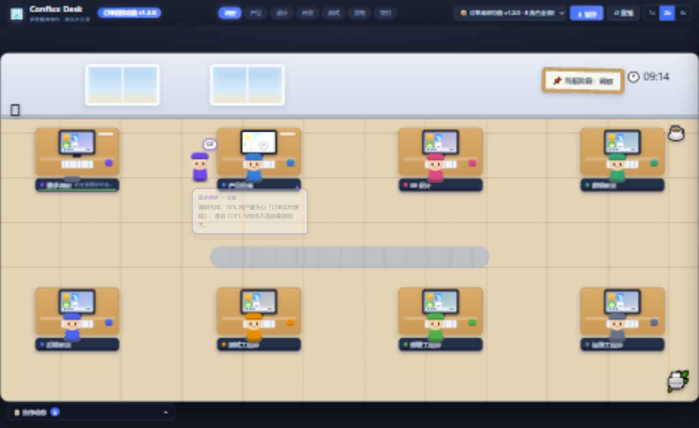
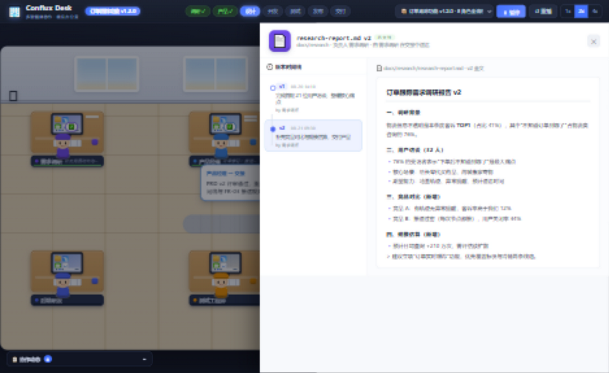

# 🏢 Conflux Desk

**Multi-agent collaboration, visualized as a virtual office.**
Watch your AI agents walk, talk, hand off work — then trace every file, and step in whenever they get it wrong.

[](LICENSE)


<p align="center">
  
</p>

Each role in your pipeline — research, product, design, frontend/backend, QA, deploy, ops — sits at a desk in a 2D office. When work is handed off, the agent **gets up, walks to the next desk**, and speaks via a **speech bubble**. A bug? QA walks back to the dev's desk with a red bubble. Click any workstation to open the full detail drawer.

## Why another agent visualizer?

Existing tools show agents as **chat streams or DAG graphs**. Conflux Desk bets on a spatial office metaphor, and adds the three things dashboards lack:

| | OpenClaw Office / AI Town | Conflux Desk |
| --- | --- | --- |
| Metaphor | Virtual office / town ✅ | Virtual office ✅ |
| **Traceable** — every file with version timeline, code diff, and the message that delivered it | ❌ | ✅ message ↔ file bidirectional tracing |
| **Interruptible** — pause, @ any agent as "supervisor", give instructions, get acknowledgment | ❌ (watch-only) | ✅ human-in-the-loop |
| **Embeddable** — runtime-agnostic plugin (`Desk.mount()` + postMessage), not tied to one gateway | ❌ (bound to OpenClaw) | ✅ one `<script>`, hot data reload |
| Stack | Next.js + SQLite + WebSocket | **zero-dependency static files** |

## Quick start

**Standalone demo** — double-click `index.html`, or:

```bash
node server.js        # → http://localhost:8765/
```

**Embed in your project** — copy the folder in, then:

```html
<div id="desk" style="height:700px"></div>
<script src="./desk/desk-plugin.js"></script>
<script>
  const desk = Desk.mount({ container: '#desk' });
</script>
```

Full runnable example: [`embed-demo.html`](embed-demo.html) (host buttons push live events, hot-swap project data, subscribe to plugin notifications).

## API

| Method | Effect |
| --- | --- |
| `desk.loadProject(obj)` | Hot-replace project data (`roles` / `files` / `script`) — scene rebuilds, no reload |
| `desk.sendEvent(step)` | Live event: `{type:'handoff', from, to, text, kind, att}` walk+bubble+file delivery; `{type:'work', role, task, dur}`; `{type:'phase', name}` |
| `desk.pause()` / `resume()` / `replay()` | Playback control |
| `desk.intervene(roleId, text)` | Send a "👔 supervisor" instruction to one agent (auto-pauses) |
| `desk.on(fn)` | Subscribe: `desk:ready` `desk:phase` `desk:handoff` `desk:done` `desk:error` |

Wiring a real agent runtime is just an event adapter:

```js
myAgentBus.on('task_handoff', e => desk.sendEvent({
  type: 'handoff', from: e.fromRole, to: e.toRole,
  text: e.summary, att: e.attachments,
}));
```

<p align="center">
  
</p>

## Security

- `postMessage` is **origin-validated on both sides** (host allowlist via `Desk.mount({ allowedOrigins })`, direct-parent check, targeted replies — no `'*'` broadcast after handshake).
- All project-sourced strings are HTML-escaped at render time; colors are allowlist-validated — safe against injected project data.
- `index.html` ships a CSP (`script-src 'self'`); iframe options: optional `sandbox`, `referrerpolicy=no-referrer`.
- If you self-host, consider adding an `X-Frame-Options` / `frame-ancestors` header to control who may embed the plugin.

## Project data (one folder per project)

```
projects/
├── _template/project.js    ← annotated template
├── order-tracking/         ← 8-role full pipeline demo
├── official-website/       ← 5-role lean demo
└── registry.js             ← dropdown registry (optional)
```

`roles` (2–10, desks auto-laid out) · `files` (versions with diff/doc/mock/log content) · `script` (`phase` / `work` / `handoff` steps, bug loops supported). See [projects/README.md](projects/README.md) and the [tutorial](使用教程.md).

## Limitations (honest)

- Demo-driven by a scripted simulator; official adapters for LangGraph / CrewAI / OpenClaw are on the roadmap.
- Events execute serially (queued); parallel agent runs are visualized sequentially.
- 2–10 roles per project; no persistence across refresh (by design — state belongs to the host).

## Roadmap

- [ ] Official adapter: LangGraph / CrewAI / OpenClaw gateway
- [ ] Event recording + `Desk.replay(events)`
- [ ] i18n (zh/en), parallel-event lanes, multi-room layouts

## License

[MIT](LICENSE) © 2026 Conflux Desk contributors

---

# 🏢 Conflux Desk（中文说明）

**把多智能体协作画成一间看得见的虚拟办公室。**

需求调研、产品、设计、前后端、测试、部署、运维——每个角色坐在自己的工位上。工作交接时角色**起身走到对方工位**，头顶**弹出对话气泡**；测试发现 Bug 会拿着红色气泡走回研发工位。点开工位电脑，可以看到该角色全部交接消息与文件版本。

**三个差异化**（对比 OpenClaw Office / AI Town 等同类）：

1. **可追溯** —— 每个文件带版本时间线、代码 diff，以及“它由哪条消息交付、因哪个 Bug 修改”的双向链路；
2. **可介入** —— 随时暂停，以「👔 主管」身份 @ 任意角色下指令，角色气泡确认并记入档案（human-in-the-loop）；
3. **可嵌入** —— 运行时无关的 iframe 插件（`Desk.mount()` + postMessage API），支持数据热替换，零依赖纯静态。

快速开始：双击 `index.html` 或 `node server.js`；嵌入用法与 API 表见上方英文部分，完整教程见[使用教程.md](使用教程.md)，可运行示例见 [embed-demo.html](embed-demo.html)。MIT 协议，欢迎 Star / PR。
